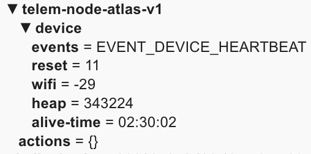
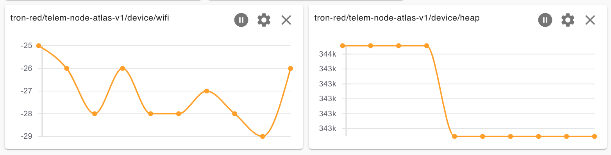
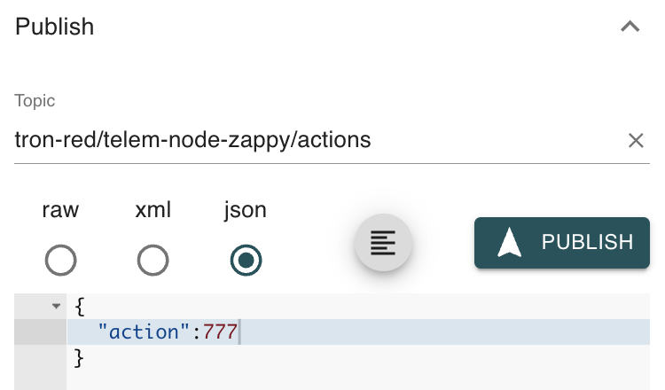

# ESP-Telemetry-Node

## Dependencies

| Library            | By                   |
| ------------------ | -------------------- |
| ArduinoMqttClient  | By Arduino           |
| ArduinoJson        | Benoit Blanchon      |
| RunnableLed        | By Scott Linenberger |
| ArduinoDebugLogger | By Scott Linenberger |

## What is ESPTelemetry Node?

An easy to use, yet powerful connection mananager for WiFi and MQTT client connections. Makes getting connected to WiFi and your MQTT broker easy (works with AdafruitIO too! - examples below). This Arduino library helps your ESP say, "Hey, I'm still here and I'm doing great!" with heartbeats that publish helpful event info and device telemetry metrics like WiFi signal, alive time, free heap memory and the reset reason from the last time your board went down. ESP-Telemetry-Node is highly configurable too. Install the ESP Telemetry Node library using the [The Arduino IDE](https://www.arduino.cc/en/software) and locate examples and configuration templates under `File->Examples->LinenTools ESP Telemetry Node`.

## Features

- Easy connections with less boiler-plate code
- Recover and reconnect logic to keep your ESP connected
- Publishes device event messages
- Publishes reset reason on restart
- Publishes configurable telemetry heartbeats
  - WiFi signal strength
  - time alive
  - free heap memory
- Responds to incoming actions for realtime configuration updates
  - change telemetry metrics hearbeat frequency (heartrate)
  - disable telemetry heartbeats
  - enable telemetry heartbeats
- Responds to incoming actions for device control
  - on-demand heartbeats
  - reboot device remotely




## Helpful tools & resources

- [MQTT Explorer](https://mqtt-explorer.com/) - a great tool for viewing MQTT topics & used for the screenshots in this doc
- [The Arduino IDE](https://www.arduino.cc/en/software) - flashing your microcontroller, code example

## Quick Start

1. Enter connection info in `TELEM_CONFIG.h`  
   a. WiFi SSID & pass
   b. MQTT broker ip, client info, & credentials
2. Upload to your selected board: `Sketch->Upload`
3. Open Serial Monitor (baud rate 115200) to watch output\*

_\*Note: if you set device logging (under Serial baud rate in the config) to `false`, there will be no `Serial` output._

```cpp
#include <Arduino.h>
#include <TelemetryNode.h>
/* Configure the telemetry node */
#include "TELEM_CONFIG.h"

/* Connections */
WiFiClient wiFiClient;
MqttClient mqttClient(wiFiClient);

/* Telemetry Node */
TelemetryNode telemNode = TelemetryNode(
  wiFiClient,
  mqttClient,
  TELEM_CONFIG
);

void setup() {
    /* begin the telemetry node */
    telemNode.begin();

    /* connect TelemetryNode to network & MQTT */
    telemNode.connect();

    // do MQTT pub/sub
    mqttClient.onMessage(onMqttOnMessage);
    /* subscribe to telemetry node actions to respond to action requests */
    mqttClient.subscribe(TELEM_CONFIG.topic.incoming_actions, 1);
}

void onMqttOnMessage(int messageSize) {
  /* process incoming messages so telemetry node can respond to action requests */
  JsonDocument json = telemNode.processIncomingMessage(messageSize);
}

void loop() {
    telemNode.run();
}
```

`TELEM_CONFIG.h` (included on line 2 of the example code above)

```cpp
const TelemetryNodeConfig TELEM_CONFIG = {
  /* CONNECTION */
  {
    "wifiSSID", // -------------------------- Wifi SSID
    "wifiPassword", // ---------------------- Wifi Password
      "0.0.0.0", // ------------------------- MQTT Broker IP Address
      1883, // ------------------------------ MQTT Broker Port
      "uname", // --------------------------- MQTT username
      "password", // ------------------------ MQTT password
      "<mqtt-client-id>", // ---------------- MQTT client ID
      false, // ----------------------------- MQTT clean session flag
      5, // --------------------------------- MQTT connection retries before reboot
      {
        true, // ---------------------------- MQTT send last will message
        "EVENT_DEVICE_OFFLINE", // --------------------------- MQTT last will JSON string
        true, // ------------------------------ MQTT last will retain
        1, // --------------------------------- MQTT last will QOS
      }
  },
  /* DEVICE */
  {
    115200, // ---------------------------- Serial baud rate
    true, // ------------------------------ logs Serial output when true, does NOT when false
    /* MQTT Message Settings - Reset Reason */
    true, // ----------------------------- retain reset reason
    0, // --------------------------------- qos reset reason
    true, // ------------------------------ enable heartbeats !! IF HEARTBEATS DISABLED, NO DEVICE METRICS WILL BE PUBLISHED !!
    { /* METRIC - Time Alive */
      true, // ------------------------------ send device time alive with heartbeat
      true, // ------------------------------ retain device time alive messages
      0 // --------------------------------- qos device time alive messages
    },
    { /* METRIC - WiFi Signal */
      true, // ------------------------------ send wifi signal strength when heartbeat
      false, // ----------------------------- retain wifi signal messages
      0 // --------------------------------- qos wifi signal messages
    },
    { /* METRIC - Free Heap Memory */
      true, // ------------------------------ send available memory heap when heartbeat
      false, // ----------------------------- retain available memory heap messages
      0 // --------------------------------- qos available memory messages
    }
  },
  /* TIMEOUTS CONFIGURATION */
  {
    300000, // ---------------------------- Keep alive timeout (5 min as ms)
    900000, // ---------------------------- Heartbeat timeout  (15 min as ms)
    30000, // ----------------------------- Time to wait between MQTT connection retry attempts
    60000, // ----------------------------- Time to wait before restarting the device after too many failed connect attempts
  },
  /* TOPIC CONFIGURATION */
  {
    "<mqtt-client-id>/actions", // ------------------------------- incoming actions topic
    "<mqtt-client-id>/telemetry", // ------------------------------- telemtry topic
    "<mqtt-client-id>/device/events", // ------------------------------- device events topic
    "<mqtt-client-id>/device/reset", // ------------------------------- device reset reason topic
    "<mqtt-client-id>/device/alive-time", // ------------------------------- device time alive
    "<mqtt-client-id>/device/wifi", // ------------------------------- wifi signal topic
    "<mqtt-client-id>/device/heap", // ------------------------------- memory available topic
  }
};
```

## Configuration Breakdown

```cpp
const TelemetryNodeConfig TELEM_CONFIG = {
  /* CONNECTION */
  {
    "wifiSSID", // -------------------------- Wifi SSID
    "wifiPassword", // ---------------------- Wifi Password
      "0.0.0.0", // ------------------------- MQTT Broker IP Address
      1883, // ------------------------------ MQTT Broker Port
      "uname", // --------------------------- MQTT username
      "password", // ------------------------ MQTT password
      "<mqtt-client-id>", // ---------------- MQTT client ID
      false, // ----------------------------- MQTT clean session flag
      5, // --------------------------------- MQTT connection retries before reboot
      {
        true, // ---------------------------- MQTT send last will message
        "EVENT_DEVICE_OFFLINE", // --------------------------- MQTT last will JSON string
        true, // ------------------------------ MQTT last will retain
        1, // --------------------------------- MQTT last will QOS
      }
  },
  /* DEVICE */
  {
    115200, // ---------------------------- Serial baud rate
    true, // ------------------------------ logs Serial output when true, does NOT when false
    /* MQTT Message Settings - Reset Reason */
    true, // ----------------------------- retain reset reason
    0, // --------------------------------- qos reset reason
    true, // ------------------------------ enable heartbeats !! IF HEARTBEATS DISABLED, NO DEVICE METRICS WILL BE PUBLISHED !!
    { /* METRIC - Time Alive */
      true, // ------------------------------ send device time alive with heartbeat
      true, // ------------------------------ retain device time alive messages
      0 // --------------------------------- qos device time alive messages
    },
    { /* METRIC - WiFi Signal */
      true, // ------------------------------ send wifi signal strength when heartbeat
      false, // ----------------------------- retain wifi signal messages
      0 // --------------------------------- qos wifi signal messages
    },
    { /* METRIC - Free Heap Memory */
      true, // ------------------------------ send available memory heap when heartbeat
      false, // ----------------------------- retain available memory heap messages
      0 // --------------------------------- qos available memory messages
    }
  },
  /* TIMEOUTS CONFIGURATION */
  {
    300000, // ---------------------------- Keep alive timeout (5 min as ms)
    900000, // ---------------------------- Heartbeat timeout  (15 min as ms)
    30000, // ----------------------------- Time to wait between MQTT connection retry attempts
    60000, // ----------------------------- Time to wait before restarting the device after too many failed connect attempts
  },
  /* TOPIC CONFIGURATION */
  {
    "<mqtt-client-id>/actions", // ------------------------------- incoming actions topic
    "<mqtt-client-id>/telemetry", // ------------------------------- telemtry topic
    "<mqtt-client-id>/device/events", // ------------------------------- device events topic
    "<mqtt-client-id>/device/reset", // ------------------------------- device reset reason topic
    "<mqtt-client-id>/device/alive-time", // ------------------------------- device time alive
    "<mqtt-client-id>/device/wifi", // ------------------------------- wifi signal topic
    "<mqtt-client-id>/device/heap", // ------------------------------- memory available topic
  }
};
```

### Telemetry Node Configuration

| Variable   | Description                                                  |
| ---------- | ------------------------------------------------------------ |
| connection | configuration variables for connections                      |
| device     | configuration variables for the ESP boards telemetry metrics |
| timeout    | configuration variales related to timing                     |
| topic      | configuration variables - MQTT topics                        |

#### Connection

| Variable                          | Description                                                                   |
| --------------------------------- | ----------------------------------------------------------------------------- |
| connection.wifi_ssid              | WiFi SSID for WiFi connection                                                 |
| connection.wifi_ssid              | WiFi password for WiFi Connection                                             |
| connection.mqtt_broker_ip_addr    | MQTT Broker IP address for MQTT connection                                    |
| connection.mqtt_broker_port       | MQTT Broker port for MQTT connection                                          |
| connection.mqtt_uname             | MQTT auth, username for MQTT connection                                       |
| connection.mqtt_pass              | MQTT auth, password for MQTT connection                                       |
| connection.mqtt_client_id         | MQTT client id for MQTT connection                                            |
| connection.mqtt_use_clean_session | MQTT clean session connection flag for MQTT connection                        |
| connection.mqtt_reconnect_tries   | Number of times MQTT connection should be retried before rebooting the device |
| connection.last_will              | MQTT last will configuration for sudden device death                          |

#### Last Will Configuration

| Variable              | Description                                                                                         |
| --------------------- | --------------------------------------------------------------------------------------------------- |
| last_will.is_sending  | enables/disables send of the MQTT last will during MQTT connection - when false, will does NOT send |
| last_will.mqtt_msg    | last will message as a raw string                                                                   |
| last_will.mqtt_retain | sets boolean retain flag when sending the last will MQTT message                                    |
| last_will.mqtt_qos    | sets the MQTT QOS level when sending the last will MQTT message                                     |

### Device Configuration

| Variable                   | Description                                                                                      |
| -------------------------- | ------------------------------------------------------------------------------------------------ |
| device.serial_baud_rate    | sets the Serial baud rate                                                                        |
| device.is_logging          | enables/disables the debug logger - when false Serial WILL NOT print to console                  |
| device.retain_reset_reason | sets the retain flag for reset reason MQTT messages                                              |
| device.qos_reset_reason    | sets the qos for reset reason MQTT messages                                                      |
| device.heartbeat_enabled   | enables/disables telemetry heartbeats - **WHEN DISABLED NO TELEMETRY METRICS WILL BE BROADCAST** |
| device.time_alive          | configures the time alive metric settings for the telemetry node                                 |
| device.wifi_signal         | configures the wifi signal metric settings for the telemetry node                                |
| device.heap_memory         | configures the heap memory metric settings for the telemetry node                                |

#### Metric Time Alive

| Variable                   | Description                                   |
| -------------------------- | --------------------------------------------- |
| time_alive.is_broadcasting | enables/disables broadcast of the metric      |
| time_alive.is_retained     | sets the retain flag for metric MQTT messages |
| time_alive.qos             | sets the QOS level for metric MQTT messages   |

#### Metric WiFi Signal

| Variable                    | Description                                   |
| --------------------------- | --------------------------------------------- |
| wifi_signal.is_broadcasting | enables/disables broadcast of the metric      |
| wifi_signal.is_retained     | sets the retain flag for metric MQTT messages |
| wifi_signal.qos             | sets the QOS level for metric MQTT messages   |

#### Metric Free Heap Memory

| Variable                         | Description                                   |
| -------------------------------- | --------------------------------------------- |
| memory_available.is_broadcasting | enables/disables broadcast of the metric      |
| memory_avialable.is_retained     | sets the retain flag for metric MQTT messages |
| memory_available.qos             | sets the QOS level for metric MQTT messages   |

### Timeout Configuration

struct TimeoutConfig {
long keep_alive;
long telemetry_heartbeat;
long mqtt_reconnect_try;
uint16_t mqtt_failed_connect_restart_delay;
};

| Variable                                  | Description                                                                       |
| ----------------------------------------- | --------------------------------------------------------------------------------- |
| timeout.keep_alive                        | delay time in ms between connection keep alive checks                             |
| timeout.telemetry_heartbeat               | delay time in ms between telemetry heartbeats                                     |
| timeout.mqtt_reconnect_try                | delay time between failed MQTT connection attempts                                |
| timeout.mqtt_failed_connect_restart_delay | delay time before restarting the board after maxing out connection retry attempts |

### MQTT Topic Configuration


### Connection Management, Keep Alive & Recovery

ESP-Telemetry-Node or "Telemetry Node" manages your `Serail`, `WiFi` and `MqttClient` connections to make getting online easy.

- WiFi reconnection logic
- MQTT server connection check & retry logic

## Remote Management Interface



To remotely interact with your ESP Telmetry Node, publish MQTT messages to the topic set in the configuration variable - `telemetryConfig.topic.incoming_actions`.

Set the incoming actions topic in the `TELEM_CONFIG.h` file under "incoming actions topic".

| Action Code | Description                                                                | Message Example                         |
| ----------- | -------------------------------------------------------------------------- | --------------------------------------- |
| `444`       | Changes the heartbeat interval (increase, decrease heartbeat frequency)    | `{ "action": 444, "heartrate": 60000 }` |
| `555`       | Enables heartbeats (does nothing if heartbeats already enabled)            | `{ "action": 555 }`                     |
| `666`       | Disables or stops heartbeats (does nothing if heartbeats already disabled) | `{ "action": 666 }`                     |
| `777`       | Publishes a heartbeat now (does nothing if heartbeats disabled)            | `{ "action": 777 }`                     |
| `999`       | Calls `ESP.restart` which causes the device to hard reset                  | `{ "action": 999 }`                     |
